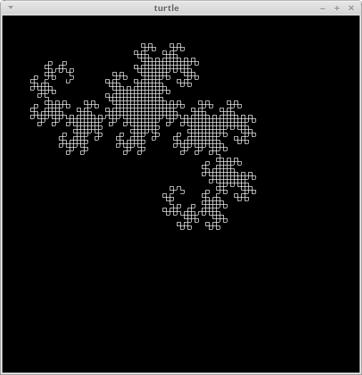

Gauche-tk Turtle
================
This is a turtle program that runs in Gauche-tk. However, the code is modular enough that it should work with any "draw-line" procedures.

Screenshot
----------
Here is a picture of the "dragon" curve.

License
-------
You may redistribute or modify this library under the terms of the GNU GPLv3, or any later version. See LICENSE for details.
